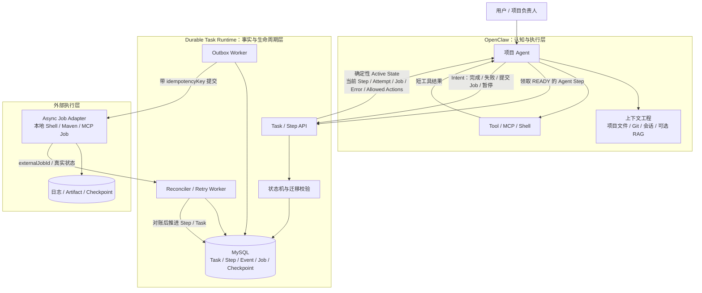
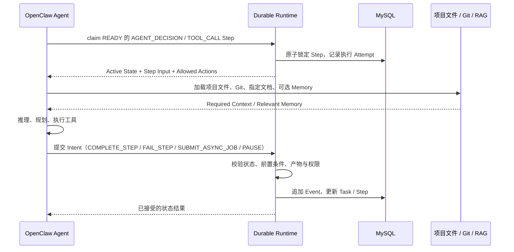
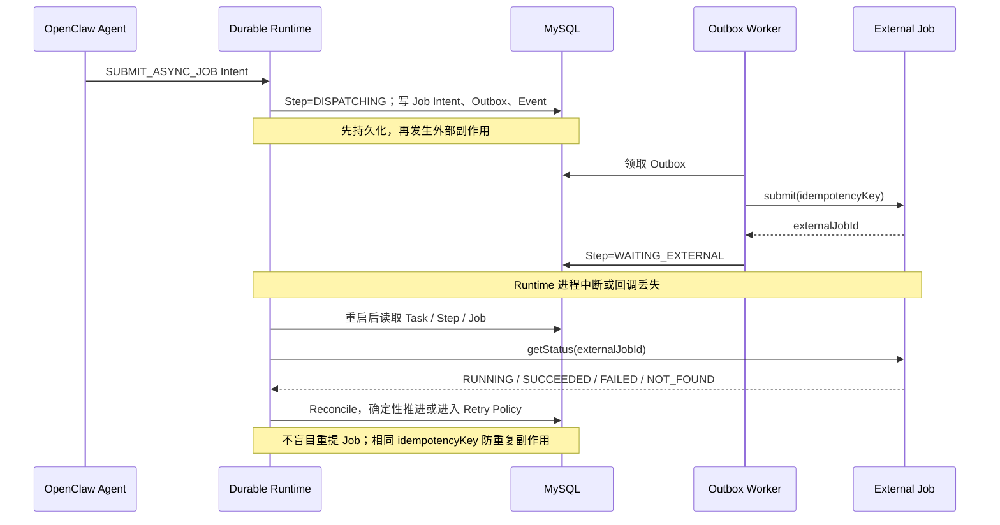

# AI4S Durable Task Runtime 架构总览

## 目标

本系统不替代 OpenClaw 的规划、推理、代码理解或上下文工程；它为长任务提供一个可持久化、可对账、可恢复的执行事实层。

> OpenClaw 决定“做什么、怎么做”；Durable Runtime 确保“已经做了什么、现在在哪里、能否安全继续”是确定的。

## 总体架构



## 职责边界

| 边界 | OpenClaw | Durable Runtime |
|---|---|---|
| 需求理解、步骤规划、动态调整计划 | 负责 | 不负责 |
| 代码库理解、文件读取、Git 状态、RAG | 负责 | 不负责 |
| Task / Step 当前真实状态 | 读取并使用 | **唯一事实来源** |
| 状态变迁合法性 | 只能提交 Intent | **校验并持久化** |
| 长 Shell / MCP Job | 提议提交 | **Outbox、幂等、重试、对账** |
| 中断恢复 | 根据 Runtime State 重建工作上下文 | **Persist、Reconcile、Resume Safely** |

Runtime 提供的是确定性的 **Active State**，而不是完整的 Agent Prompt。OpenClaw 在此基础上加载当前项目、Git、指定文件和可选记忆召回，形成执行当前 Step 所需的完整上下文。

## Agent Step 的正常工作流



## 异步 Job 与中断恢复



## 恢复时的上下文构成

```text
Runtime State（确定性事实，必须加载）
  + Task / Current Step / Attempt / Job / Error / Checkpoint / Allowed Actions

Required Context（按 Step 类型确定性加载）
  + Step Input / 上一步 Output / 指定文件 / Git 状态 / Test Artifact

Relevant Memory（概率辅助，可选加载）
  + RAG / 历史经验 / 相似 Bug / 用户偏好

=> OpenClaw Agent 执行当前 Step
```

其中只有第三层可以使用语义检索；第一层绝不能由 Markdown 搜索、Conversation 或 RAG 推断。
